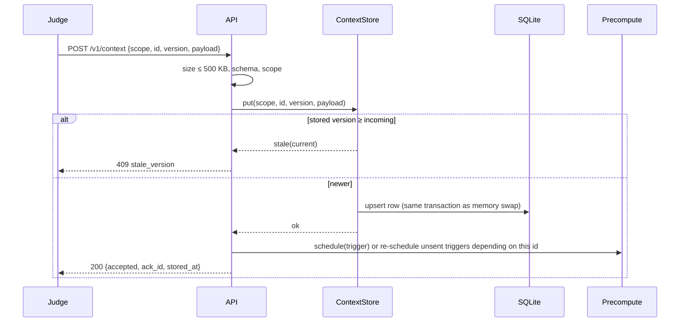
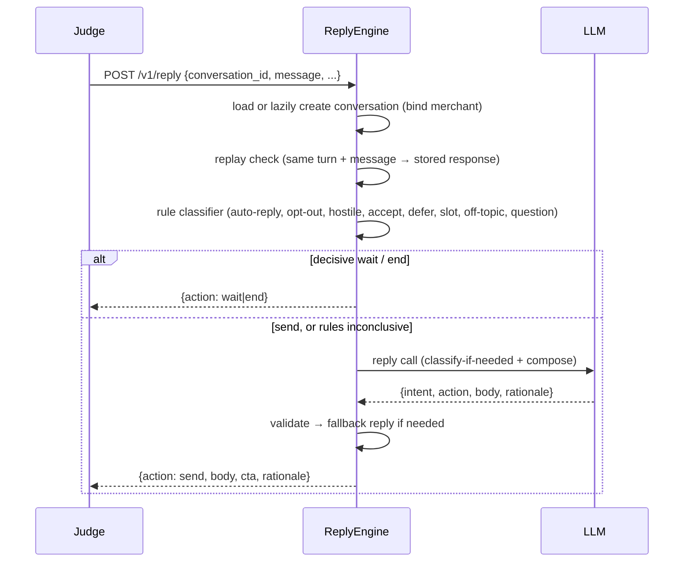

# 02 — Technical Requirements Document

| | |
|---|---|
| Owner | Amit Gautam |
| Status | Draft v1 (M1) |
| Implements | `01-PRD.md` (FR-1…FR-28, NFR-1…NFR-10) |
| Related | `03-backend-schema.md`, `05-api-contract.md`, `06-composer-spec.md`, `09-conversation-policy.md`, `12-risk-and-ambiguity-register.md`, `adr/` |

## 1. Architecture overview
One Python process serves the HTTP contract. All state lives in memory and is written through to SQLite so a
crash mid-test does not lose pushed context. Composition is a pipeline in which deterministic code does
everything except the prose: code resolves contexts into a typed fact sheet, decides the signal, CTA and
template, and validates the result; the LLM writes three short text fields.

```mermaid
flowchart LR
  J[Judge harness] -->|POST /v1/context| API
  J -->|POST /v1/tick| API
  J -->|POST /v1/reply| API
  J -->|GET healthz / metadata| API
  subgraph Vera process (1 uvicorn worker)
    API[API layer<br/>FastAPI + schemas] --> CS[(ContextStore)]
    API --> TP[TickPlanner]
    API --> RE[ReplyEngine]
    TP --> PC[Precompute tasks]
    PC --> CP[ComposePipeline]
    TP --> CP
    CP --> FS[FactSheetBuilder] --> DS[Decision step<br/>playbook registry]
    DS --> LLMC[Composer LLM call]
    LLMC --> GV[GroundingValidator]
    GV -->|fail| FB[FallbackComposer]
    RE --> RC[Rule classifier] --> RP[ReplyPolicy]
    RP --> RLLM[Reply LLM call] --> GV
    CP --> LG[LLMGateway]
    RLLM --> LG
    TP --> CV[(ConversationStore<br/>+ suppression + merchant flags)]
    RE --> CV
    CS --- DB[(SQLite WAL)]
    CV --- DB
    LG -->|HTTPS| ANT[Anthropic API]
  end
```

### Sequence: context push


### Sequence: tick
```mermaid
sequenceDiagram
  participant J as Judge
  participant T as TickPlanner
  participant C as ComposePipeline
  participant L as LLM
  J->>T: POST /v1/tick {now, available_triggers}
  T->>T: resolve → guards → rank → per-merchant cap → ≤20
  par for each selected trigger
    T->>C: await precomputed task or start compose
    C->>L: composer call (if not cached)
    L-->>C: {opener, middle, ask, rationale}
    C->>C: validate → drop sentence / repair / fallback
  end
  T->>T: wait until deadline (7 s); late tasks → fallback template
  T->>T: record conversations + suppression keys (write-through)
  T-->>J: {actions: [...]}
```

### Sequence: reply


## 2. Tech stack
| Choice | Why | ADR |
|---|---|---|
| Python 3.11+ (developed on 3.14) | Challenge ecosystem, fast iteration, the official SDK | 001 |
| FastAPI + Uvicorn, **1 worker** | Async I/O for parallel LLM calls; state is in-process, so more workers would split it | 001 |
| Pydantic v2, `extra="allow"` | Tolerant parsing of contexts the judge may extend; strict on our own outputs | 001 |
| Anthropic async SDK, `claude-sonnet-5` | Quality prose in Hinglish and clinical registers; structured JSON output | 002 |
| SQLite (stdlib `sqlite3`, WAL) write-through | Crash recovery with zero new services; restore window prevents stale state | 003 |
| Compose cache keyed by input hash | Determinism (the composer model rejects `temperature`) and warm-path latency | 004 |
| pytest, pytest-asyncio, hypothesis, ruff, mypy | Tests and invariants; mypy strict on `compose/` and `reply/` | 001 |
| Stdlib `logging` with a JSON formatter | Structured logs without another dependency | 001 |

## 3. Module map
```
src/vera/
  config.py            env → Settings (dataclass)
  app.py               FastAPI app, routes, exception guards
  api/schemas.py       request/response models (05-api-contract)
  store/state.py       ContextStore, ConversationStore, suppressions, merchant flags (memory)
  store/sqlite.py      write-through persistence, restore window, teardown wipe
  planner/tick.py      candidate resolution, guards, ranking, per-merchant cap, deadline
  compose/facts.py     FactSheetBuilder + derived facts + allowed-token index
  compose/numbers.py   number/₹/%/date normalisation shared by facts and validator
  compose/playbook.py  kind → family, template, CTA, levers, thin-payload + mismatch rules (07)
  compose/composer.py  prompt assembly, LLM call, assembly of body/template_params
  compose/prompts/     versioned prompt text (composer_v1, reply_v1)
  compose/validator.py grounding + style checks, sentence drop
  compose/fallback.py  deterministic family templates
  compose/cache.py     input hashing, compose cache, precompute task registry
  reply/classifier.py  rule-based intent detection (English, Hinglish, Devanagari)
  reply/policy.py      state machine (09-conversation-policy)
  reply/composer.py    reply prompt + fallback replies
  llm/gateway.py       LLMGateway protocol + AnthropicGateway (timeouts, no retries, JSON)
  domain/language.py   language directive, Hinglish detection
  domain/salutation.py owner name normalisation per category
  observability/log.py JSON log formatter, timing helpers, audit record writer
bot.py, conversation_handlers.py   offline deliverables that call the same pipeline
```

## 4. Component specifications

### 4.1 API layer (`app.py`, `api/schemas.py`)
- Implements `05-api-contract.md` exactly. Request bodies are read as raw bytes first to enforce the 500 KB cap
  before JSON parsing.
- A custom `RequestValidationError` handler replaces FastAPI's 422 with the contract's 400 / safe responses.
- Every route is wrapped by a guard that catches `Exception` (never bare `except:`), logs it with the request
  id and input digest, and returns the endpoint's safe response. No route can return 5xx.
- Healthz and metadata read in-memory values only.

### 4.2 ContextStore (`store/state.py`)
- `dict[(scope, context_id)] → StoredContext(version, payload, stored_at)` plus per-scope counters.
- `put` compares versions under an `asyncio.Lock` (single event loop, so the lock only guards interleaving
  across `await` points), writes SQLite, then swaps the in-memory entry. Readers always see a complete version.
- Lookups: `merchant(id)`, `category(slug)`, `customer(id)`, `trigger(id)`; customers indexed by merchant.
- `dependents(scope, id)` returns stored, unsent triggers whose compose inputs include that context (for
  re-precompute on version bumps).

### 4.3 ConversationStore, suppression ledger, merchant flags (`store/state.py`)
- `Conversation`: id, merchant_id, customer_id, trigger_id, kind, family, state, turns, promised deliverable,
  soft-no count, language of last inbound, created_at.
- Suppression ledger: set of sent `suppression_key`s. A key is added only when an action is actually returned.
- Merchant flags: `opted_out` (with the inbound timestamp; blocks proactive sends for 30 days of message time,
  i.e. for the whole test window), `auto_reply_hashes` (normalised text hash → count, per merchant, across
  conversations), `sent_bodies` (normalised body hashes, for anti-repetition), `unanswered_proactive` (09 §3).
- Reply replay cache: `(conversation_id, turn_number, sha256(message)) → response`.

### 4.4 TickPlanner (`planner/tick.py`)
1. **Resolve**: dedupe `available_triggers` preserving order; ignore ids we do not hold (log). Only listed
   triggers are candidates (R-06): the judge's list is authoritative for "active now", and we never compare
   `expires_at` with the wall-clock `now`.
2. **Guards** (each skip logged with `reason`): suppression key already sent; merchant opted out; merchant
   or category context missing; merchant has 3 unanswered proactive sends (`unanswered_3`); customer-scoped trigger whose consent gate fails *and* whose approval
   message to the merchant has no hook (otherwise it is re-routed, see 4.6); customer already contacted this
   tick; playbook says stay silent.
3. **Rank**: urgency (5 → 1), then earlier `expires_at` first (comparing triggers with each other, not with
   the clock), then list order. Deterministic.
4. **Cap**: first merchant-facing candidate per merchant wins this tick; later ones stay unsent and are eligible
   when listed again. Customer-facing sends are limited to one per customer. Total ≤ 20.
5. **Compose** all selected concurrently (awaiting precompute tasks where they exist) with
   `asyncio.wait(timeout=deadline_remaining)`. Tasks still running at the deadline are cancelled and served
   by the fallback composer (which is synchronous and takes microseconds).
6. **Commit**: create conversations, add suppression keys and body hashes, write through, return actions.

### 4.5 FactSheetBuilder (`compose/facts.py`)
Deterministic, no LLM. Produces a `FactSheet`: ordered `Fact` records (`id`, `label`, `value`, `render`,
`source_path`, `visible_to_judge`, `relevance`), the voice block, language directive, salutation, offers
(merchant active first; catalog items flagged `suggestion_only`), and the **allowed-token index** used by the
validator (every numeric rendering of every fact, every known proper noun, every source string).

Derived facts are computed in code only, e.g.: CTR as a percentage (`0.021 → 2.1%`), gap to peer
(`3.0 − 2.1 = 0.9 points`), ratio to peer (`62 / 28 → 2.2×`), 7-day deltas as signed percentages, share of a
cohort (`124 of 540`), days between two *payload* dates (never involving `now`). Each derived fact records its
formula in `source_path` (`derived: performance.ctr − peer_stats.avg_ctr`).

### 4.6 Decision step (`compose/playbook.py`)
Pure function of the fact sheet and trigger: returns `Decision(family, template_name, send_as, recipient,
primary_fact_id, supporting_fact_ids ≤ 2, levers ≤ 3, cta, language, framing_notes, skip_reason?)`.
Rules per kind are specified in `07-trigger-playbook.md`; the registry is data, so an unknown kind maps to the
generic handler. Customer-scoped triggers pass through the consent gate (ADR-008); a failed gate re-routes to
a merchant-facing approval message (`vera_customer_approval_v1`) built from payload facts only.

### 4.7 Composer (`compose/composer.py`, `compose/prompts/`)
- One LLM call per message. Input: system prompt (`composer_v1`: role, rules, voice guide excerpt for the
  category, family-specific instructions) + user content (fact sheet rendered as labelled lines, decision,
  language directive, prior bodies to this merchant for anti-repetition).
- Output via structured outputs (`output_config.format` with a JSON schema):
  `{opener, middle, ask, rationale}`. Code assembles `body = f"{opener} {middle} {ask}"`,
  `template_params = [opener, middle, ask]`, and sets `template_name` and `cta` from the decision.
- Request settings: `model=VERA_COMPOSER_MODEL`, `thinking={"type": "disabled"}` (Sonnet 5 otherwise runs
  adaptive thinking and adds latency), no sampling parameters (rejected with 400 on Sonnet 5), `max_tokens`
  ~600, per-call timeout = remaining deadline, `max_retries=0`.
- Details: `06-composer-spec.md`.

### 4.8 GroundingValidator (`compose/validator.py`)
Checks, in order: structure (non-empty parts, `ask` is the only CTA and contains the only question mark in
body); URLs; taboo phrases (`voice.vocab_taboo`, parenthetical stripped, case-insensitive); snake_case or field
names; every digit-run traces to the allowed-token index; dates only from payload/slot dates; ALL-CAPS tokens
in an allowlist or the index; honorific + name refers to a known person; source phrases match a context
source; no re-introduction after turn 1; no repeat of a prior body (normalised); case-study similarity
(`difflib` ratio ≤ 0.6). Full rule list with normalisation: `06-composer-spec.md` §5.

Failure handling ladder: (1) drop the offending sentence from `middle` if what remains still carries the primary
signal; (2) one repair call listing the violations, only if ≥ 3 s remain; (3) fallback template. Whenever the body
changes after the LLM call, the rationale is rebuilt in code from the decision record so the two always agree.

### 4.9 FallbackComposer (`compose/fallback.py`)
Deterministic templates per family × send_as, filled from the decision's primary and supporting facts, the
salutation and the CTA sentence for the family. Hinglish and English variants. Always valid by construction
(they only interpolate facts from the sheet). Also used when `ANTHROPIC_API_KEY` is unset or
`VERA_LLM_ENABLED=false`. Original wording, no case-study text.

### 4.10 Compose cache and precompute (`compose/cache.py`)
- `input_hash = sha256(canonical_json({prompt_version, model, trigger(version, payload), merchant(version),
  category(version), customer(version), decision}))`. Canonical JSON = sorted keys, no whitespace, UTF-8.
- Cache: `input_hash → ComposedMessage`, in memory and in SQLite (`compose_cache`). Identical inputs return the
  stored output byte for byte.
- Precompute: a dict `input_hash → asyncio.Task` (single flight). Scheduled on trigger push and, for unsent
  triggers, on a version bump of any context they depend on. Background tasks respect the LLM concurrency cap
  and never block a request handler.
- Only validated LLM outputs are cached; fallback outputs are not cached, so a later identical request can
  still get the LLM version (M4 measures whether this matters).

### 4.11 ReplyEngine (`reply/`)
- `classifier.py`: ordered rules (09 §2) over the normalised inbound; returns `(intent, confidence, evidence)`.
- `policy.py`: state machine (09 §3) → `send | wait | end` plus what a `send` must contain (acknowledgement,
  deliverable, redirect, apology).
- `composer.py`: one LLM call (`reply_v1`) that receives conversation state, the promised deliverable, the fact
  sheet of the original trigger, the inbound message, the policy directive and, if the rules were
  inconclusive, asks the model to classify and act in the same call. Output `{intent, action, body, cta,
  wait_seconds, rationale}`, validated like tick output (numbers from the merchant's own message are added to
  the allowed index). Fallback replies are deterministic per intent.
- Deadline 5 s (`VERA_REPLY_DEADLINE_S`).

### 4.12 LLMGateway (`llm/gateway.py`)
- `Protocol` with `complete_json(system, user, schema, timeout_s) -> dict`; one implementation over
  `anthropic.AsyncAnthropic(max_retries=0)`.
- A semaphore caps concurrent calls (`VERA_LLM_MAX_CONCURRENCY`, default 10). Error mapping: timeout,
  `RateLimitError`, `APIStatusError ≥ 500`, `APIConnectionError` → `LLMUnavailable` (caller falls back at once);
  `BadRequestError` → logged as a bug, fallback. No retries inside a request deadline.
- Logs per call: model, prompt version, input/output tokens, latency, outcome.

### 4.13 Observability (`observability/log.py`)
JSON lines to stderr: `ts, level, event, request_id, endpoint, latency_ms, merchant_id, trigger_id,
conversation_id, decision, skip_reason, validator_violations, llm_outcome, tokens`. An audit record per
composed message (input hash, prompt version, facts used, output, path taken: cache / llm / repaired /
fallback) is kept in SQLite `audit_log` for the eval harness.

## 5. Latency budget
| Stage | Budget | Notes |
|---|---|---|
| `/v1/context` total | < 200 ms | JSON parse of ≤ 500 KB + one SQLite upsert; precompute is scheduled, not awaited |
| `/v1/healthz`, `/v1/metadata` | < 50 ms | Memory only |
| Tick: resolve + guards + rank | < 20 ms | Up to 20 candidates |
| Tick: fact sheet per trigger | < 10 ms | Pure Python |
| Tick: LLM compose (parallel) | ~2–5 s | Thinking disabled, ~150 output tokens; measured in M4 |
| Tick: validation | < 5 ms per message | Regex + set lookups |
| Tick: repair | only if ≥ 3 s remain | One call |
| Tick hard deadline | 7 s (`VERA_TICK_DEADLINE_S`) | Then fallback for anything unfinished |
| Tick warm path | < 500 ms | All from cache |
| Reply: rules | < 5 ms | |
| Reply: LLM | ~2–4 s | Deadline 5 s, then fallback reply |

Concurrency model: one asyncio event loop; CPU work is small and synchronous; SQLite writes are synchronous
(sub-millisecond on WAL) and happen on the loop, which is acceptable at 10 req/s. Cancellation: tasks past
the deadline are cancelled; their results are discarded, never written to the cache half-done.

## 6. Determinism
- The composer model does not accept `temperature` (400 on Sonnet 5), so determinism comes from the cache:
  identical inputs → identical stored output.
- Canonical JSON everywhere a hash or a prompt is built (sorted keys, stable list order as received).
- Conversation ids derive from inputs: `conv_{merchant_short}[_{customer_short}]_{kind}_{yyyymmdd(now)}_{hash6}`
  where `hash6 = sha256(trigger_id|customer_id|trigger_version)[:6]`.
- No wall-clock values in bodies. Relative-time words ("today", "tonight", "tomorrow") only when the trigger kind
  or payload states them (e.g. `ipl_match_today`, `appointment_tomorrow`).
- Tie-breaks in ranking use list order, never randomness.
- The offline deliverables (`bot.py`, `submission.jsonl`) call the same pipeline with the same cache file, so a
  rerun reproduces the committed output.

## 7. Error-handling matrix
| Endpoint | Failure | Response | Logged as |
|---|---|---|---|
| context | body > 500 KB | 400 `payload_too_large` | `context.rejected` |
| context | invalid JSON / schema | 400 `invalid_body` + details | `context.rejected` |
| context | unknown scope | 400 `invalid_scope` | `context.rejected` |
| context | stale version | 409 `stale_version` | `context.stale` |
| context | SQLite error | 400 `internal_error` (memory unchanged) | `context.error` |
| tick | invalid JSON | 400 `{"actions": [], "error": "invalid_body"}` | `tick.rejected` |
| tick | unknown trigger id | skip | `tick.skip reason=unknown_trigger` |
| tick | missing merchant/category | skip | `tick.skip reason=missing_context` |
| tick | LLM timeout / 429 / 5xx / connection | fallback template | `compose.fallback` |
| tick | validator fails after repair | fallback template | `compose.fallback reason=validation` |
| tick | exception in one compose | that trigger skipped, others returned | `compose.error` |
| tick | exception in planner | `{"actions": []}` | `tick.error` |
| reply | invalid JSON | 400 safe wait | `reply.rejected` |
| reply | unknown conversation id | lazy state bound to `merchant_id` | `reply.lazy_conversation` |
| reply | unknown merchant | reply without merchant facts (generic, no numbers) | `reply.no_merchant` |
| reply | LLM failure | deterministic fallback reply for the intent | `reply.fallback` |
| reply | exception | `{"action": "wait", "wait_seconds": 3600}` | `reply.error` |
| healthz | any | always 200 from memory | — |

## 8. Persistence and recovery
- Tables and DDL: `03-backend-schema.md` §4. WAL mode, `synchronous=NORMAL`.
- Write-through on every accepted context, sent action, reply turn, flag change, cache entry.
- **Restore window** (ADR-003): on boot, if the database's newest write is within `VERA_RESTORE_WINDOW_S`
  (default 7200 s), reload everything; otherwise wipe it and start empty. A crash during a 60-minute test
  window restores state; a fresh start hours later begins at zero, so warmup healthz reads 0/0/0/0 before the
  judge pushes and exactly 5/50/200/0 after.
- `/v1/teardown` wipes memory and all tables.

## 9. Security and privacy
- No secrets in the repository; `.env` is gitignored; `.env.example` lists names only. Keys come from the host's
  secret manager in production.
- Payload data leaves the process only in requests to the Anthropic API. No other outbound calls.
- The simulator is run through a wrapper that injects the judge key from env; the vendor file is never edited.
- Teardown wipes all stored data; the restore window caps how long data can survive a missed teardown.
- Logs contain ids and digests, never full payloads or phone fields.

## 10. Configuration reference
Priority: environment variables → `.env` file → defaults below.

| Variable | Default | Meaning |
|---|---|---|
| `ANTHROPIC_API_KEY` | — | Enables the LLM composer; unset → fallback-only mode |
| `VERA_LLM_ENABLED` | `true` | Kill switch for LLM calls |
| `VERA_COMPOSER_MODEL` | `claude-sonnet-5` | Model for tick and reply composition |
| `VERA_LLM_MAX_CONCURRENCY` | `10` | Concurrent LLM calls |
| `VERA_LLM_TIMEOUT_S` | `6` | Upper bound per LLM call (further capped by the deadline) |
| `VERA_TICK_DEADLINE_S` | `7` | Tick hard deadline |
| `VERA_REPLY_DEADLINE_S` | `5` | Reply hard deadline |
| `VERA_REPAIR_MIN_REMAINING_S` | `3` | Minimum time left to attempt a repair call |
| `VERA_DB_PATH` | `data/vera.db` | SQLite file |
| `VERA_RESTORE_WINDOW_S` | `7200` | Restore state on boot only if the last write is this recent |
| `VERA_MAX_PAYLOAD_BYTES` | `512000` | Context body cap |
| `VERA_TEAM_NAME` | `Amit Gautam` | `/v1/metadata` |
| `VERA_TEAM_MEMBERS` | `Amit Gautam` | Comma-separated |
| `VERA_CONTACT_EMAIL` | — | `/v1/metadata` |
| `VERA_SUBMITTED_AT` | process start time | `/v1/metadata` |
| `PORT` | `8080` | HTTP port |
| `LOG_LEVEL` | `INFO` | Logging level |

## 11. Resolutions of the harness findings
Each item is detailed in `12-risk-and-ambiguity-register.md`.

| Finding | Resolution in this design |
|---|---|
| B1 simulator timeouts 5/10/15 s | Deadlines 7 s tick, 5 s reply; context/healthz memory-only (§5) |
| B2 placeholder payloads | Playbook thin-payload strategies; validator blocks invented specifics (§4.6, §4.8) |
| B3 kind/category mismatch | Playbook reinterpretation or silence, stated in the rationale (§4.6) |
| B4 sparse merchants | Fact ranking uses whatever exists: performance, deltas, peer gaps, locality, digest, seasonal, catalog suggestions (§4.5) |
| B5 contradictions | 409 on same version; never URLs; strictest timeouts; both rubric names; explicit dates only (§4.1, §4.8, §6) |
| B6 expiry vs wall clock | Only listed triggers are candidates; `expires_at` never compared with `now` (§4.4) |
| B7 replies on unseen conversation ids | Lazy conversation state; auto-reply counter per merchant across conversations (§4.3, §4.11) |
| B8 keyword intent check | Action mode delivers the artefact, confirm CTA, no qualifying phrasing (09) |
| B9 hostile handling | `end` + merchant opt-out flag (09) |
| B10 simulator uses seeds; harness uses expanded | Both are test targets (10) |
| B11 process model | 1 worker, write-through SQLite with restore window (§8) |
| N1 Windows encoding | Run simulator under `PYTHONUTF8=1`; our code always passes `encoding="utf-8"` |
| N2 simulator never pushes customers | Customer-scoped triggers re-route to merchant approval messages (§4.6) |
| N3 scorer visibility | Prefer judge-visible facts for the primary hook; attribute deeper facts in the body (06) |
| N4 retired simulator default model / thinking blocks | Wrapper sets the model and reads the first text block (10) |
| N5 promotional-only consent | Scope changes framing, not eligibility (ADR-008) |
| N6 "Dr." inside owner names | Salutation normaliser (§3 `domain/salutation.py`) |
| N7 `hi` everywhere | Language policy by region (ADR-007) |
| N8 kinds missing from test pairs | Golden set adds one trigger per missing kind (10) |
| N9 digest vs trigger conflicts | Trigger payload wins; dates quoted verbatim (06) |
| N10 wall-clock `now` | No relative time derived from `now` (§6) |
