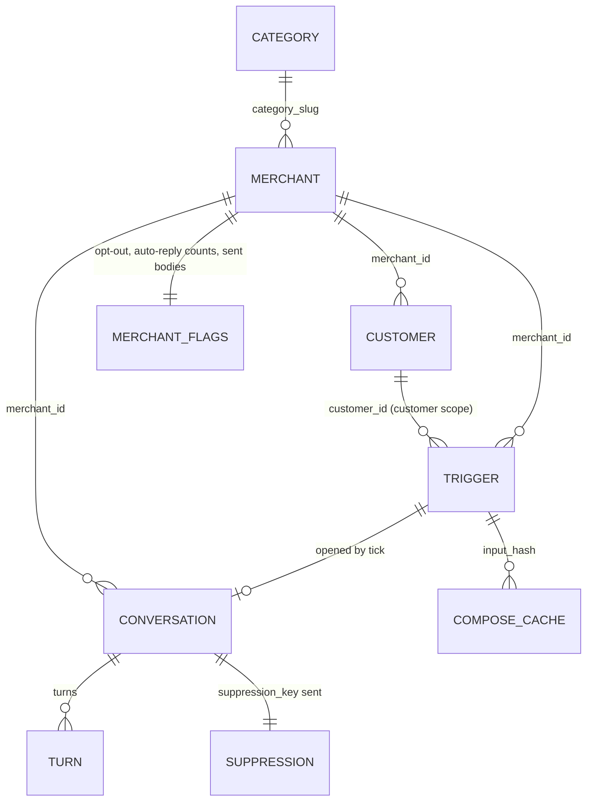
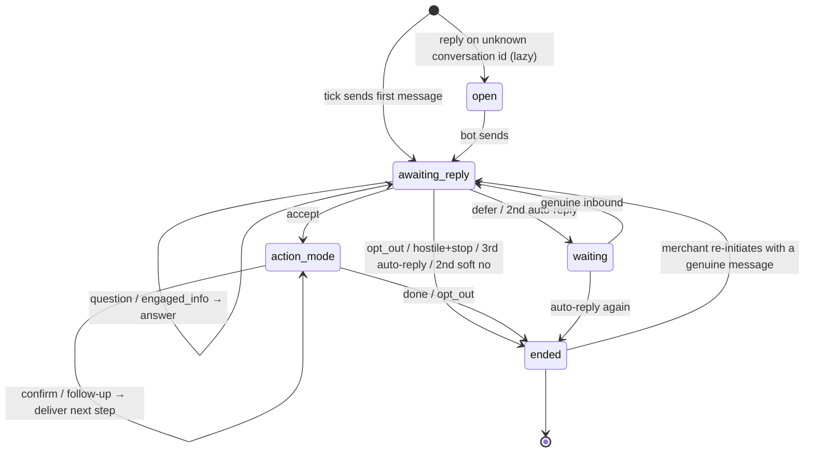

# 03 — Backend Schema

Models are Pydantic v2. Context models are **tolerant** (`extra="allow"`, every non-essential field optional)
because the judge may add or drop fields in injected contexts; our own outputs are **strict** (`extra="forbid"`).
Field lists below are the fields the code reads; anything else is kept verbatim in `payload`.

## 1. Context payloads (tolerant)

```python
class Tolerant(BaseModel):
    model_config = ConfigDict(extra="allow")

# --- category ---
class Voice(Tolerant):
    tone: str | None = None                 # "peer_clinical", "warm_practical", ...
    register: str | None = None
    code_mix: str | None = None             # "hindi_english_natural", "english_primary_some_hindi"
    vocab_allowed: list[str] = []
    vocab_taboo: list[str] = []             # NB: the brief calls this "taboos"; both keys are read
    taboos: list[str] = []
    salutation_examples: list[str] = []
    tone_examples: list[str] = []

class OfferTemplate(Tolerant):
    id: str | None = None
    title: str                              # "Dental Cleaning @ ₹299"
    value: str | None = None
    audience: str | None = None             # new_user | repeat_user | senior | all
    type: str | None = None                 # service_at_price | free_service | percentage_discount | bogo | ...

class DigestItem(Tolerant):
    id: str
    kind: str | None = None                 # research | compliance | cde | trend | tech | seasonal | supply | alert | compete
    title: str | None = None
    source: str | None = None
    summary: str | None = None
    actionable: str | None = None
    date: str | None = None
    trial_n: int | None = None
    patient_segment: str | None = None
    credits: int | None = None

class ContentItem(Tolerant):
    id: str; title: str | None = None; channel: str | None = None
    length_seconds: int | None = None; body: str | None = None

class SeasonalBeat(Tolerant):
    month_range: str | None = None; note: str | None = None

class TrendSignal(Tolerant):
    query: str | None = None; delta_yoy: float | None = None
    segment_age: str | None = None; skew: str | None = None

class CategoryContext(Tolerant):
    slug: str
    display_name: str | None = None
    voice: Voice = Voice()
    offer_catalog: list[OfferTemplate] = []
    peer_stats: dict[str, Any] = {}         # keys vary by category (avg_ctr, avg_calls_30d, retention_*_pct, ...)
    digest: list[DigestItem] = []
    patient_content_library: list[ContentItem] = []
    seasonal_beats: list[SeasonalBeat] = []
    trend_signals: list[TrendSignal] = []
    regulatory_authorities: list[str] = []
    professional_journals: list[str] = []

# --- merchant ---
class Identity(Tolerant):
    name: str | None = None; city: str | None = None; locality: str | None = None
    place_id: str | None = None; verified: bool | None = None
    languages: list[str] = []; owner_first_name: str | None = None; established_year: int | None = None

class Subscription(Tolerant):
    status: str | None = None               # active | expired | trial
    plan: str | None = None; days_remaining: int | None = None
    days_since_expiry: int | None = None; renewed_at: str | None = None

class Performance(Tolerant):
    window_days: int | None = None
    views: int | None = None; calls: int | None = None; directions: int | None = None
    ctr: float | None = None; leads: int | None = None
    delta_7d: dict[str, float] = {}         # views_pct, calls_pct, ctr_pct (fractions: -0.22 = -22%)

class MerchantOffer(Tolerant):
    id: str | None = None; title: str; status: str | None = None   # active | expired | paused
    started: str | None = None; ended: str | None = None

class HistoryTurn(Tolerant):
    ts: str | None = None; from_: str | None = Field(None, alias="from")
    body: str | None = None; engagement: str | None = None

class ReviewTheme(Tolerant):
    theme: str; sentiment: str | None = None
    occurrences_30d: int | None = None; common_quote: str | None = None

class MerchantContext(Tolerant):
    merchant_id: str
    category_slug: str
    identity: Identity = Identity()
    subscription: Subscription = Subscription()
    performance: Performance = Performance()
    offers: list[MerchantOffer] = []
    conversation_history: list[HistoryTurn] = []
    customer_aggregate: dict[str, Any] = {} # keys vary (lapsed_180d_plus, chronic_rx_count, total_active_members, ...)
    signals: list[str] = []                 # "stale_posts:22d", "ctr_below_peer_median", ...
    review_themes: list[ReviewTheme] = []

# --- customer ---
class CustomerIdentity(Tolerant):
    name: str | None = None; phone_redacted: str | None = None
    language_pref: str | None = None; age_band: str | None = None; senior_citizen: bool | None = None

class Relationship(Tolerant):
    first_visit: str | None = None; last_visit: str | None = None
    visits_total: int | None = None; services_received: list[str] = []
    lifetime_value: int | None = None; favourite_dish: str | None = None
    chronic_conditions: list[str] = []

class Consent(Tolerant):
    opted_in_at: str | None = None; scope: list[str] = []

class CustomerContext(Tolerant):
    customer_id: str
    merchant_id: str
    identity: CustomerIdentity = CustomerIdentity()
    relationship: Relationship = Relationship()
    state: str | None = None                # new | active | lapsed_soft | lapsed_hard | churned
    preferences: dict[str, Any] = {}        # preferred_slots, channel, reminder_opt_in, wedding_date, ...
    consent: Consent = Consent()

# --- trigger ---
class TriggerContext(Tolerant):
    id: str
    scope: str = "merchant"                 # merchant | customer
    kind: str
    source: str | None = None               # internal | external
    merchant_id: str | None = None
    customer_id: str | None = None
    payload: dict[str, Any] = {}            # kind-specific; {"placeholder": true, ...} for generated triggers
    urgency: int = 1                        # 1..5
    suppression_key: str | None = None
    expires_at: str | None = None

    @property
    def is_placeholder(self) -> bool: return bool(self.payload.get("placeholder"))
```

Parsing rule: the raw payload is stored; typed views are built on read and a parse failure in a non-essential
field degrades to "field absent", never to a rejected context. Only `slug` (category), `merchant_id` +
`category_slug` (merchant), `customer_id` + `merchant_id` (customer) and `id` + `kind` (trigger) are
essential; without them the context is stored but reported as unusable in logs, and the planner skips it.

## 2. Request / response bodies (strict)
```python
Cta = Literal["open_ended", "binary_yes_no", "binary_confirm_cancel", "multi_choice_slot", "none"]
Scope = Literal["category", "merchant", "customer", "trigger"]

class ContextPush(BaseModel):
    scope: str; context_id: str; version: int; payload: dict[str, Any]; delivered_at: str | None = None

class TickRequest(BaseModel):
    now: str; available_triggers: list[str] = []

class TickAction(BaseModel, extra="forbid"):
    conversation_id: str; merchant_id: str; customer_id: str | None
    send_as: Literal["vera", "merchant_on_behalf"]; trigger_id: str
    template_name: str; template_params: list[str]
    body: str; cta: Cta; suppression_key: str; rationale: str

class ReplyRequest(BaseModel):
    conversation_id: str; message: str
    merchant_id: str | None = None; customer_id: str | None = None
    from_role: Literal["merchant", "customer"] = "merchant"
    received_at: str | None = None; turn_number: int | None = None

class ReplySend(BaseModel, extra="forbid"):
    action: Literal["send"] = "send"; body: str; cta: Cta; rationale: str
class ReplyWait(BaseModel, extra="forbid"):
    action: Literal["wait"] = "wait"; wait_seconds: int; rationale: str
class ReplyEnd(BaseModel, extra="forbid"):
    action: Literal["end"] = "end"; rationale: str
```
`ContextPush.scope` is a plain `str` so an unknown scope reaches our handler and gets the contract's
`invalid_scope` instead of a generic validation error.

## 3. Internal entities
```python
class Fact(BaseModel):
    id: str                         # "F03" — stable order within one sheet
    label: str                      # human label shown to the LLM: "Your CTR, last 30 days"
    value: Any                      # raw value (0.021)
    render: str                     # "2.1%"
    source_path: str                # "merchant.performance.ctr" | "derived: performance.ctr - peer_stats.avg_ctr"
    kind: Literal["number", "money", "percent", "date", "name", "text", "offer", "source"]
    visible_to_judge: bool          # appears in the simulator scorer's context view
    relevance: float                # 0..1 for this trigger kind

class FactSheet(BaseModel):
    trigger_id: str; kind: str; family: str; is_placeholder: bool
    facts: list[Fact]
    voice: Voice; language: str      # "hinglish" | "english" | "english_light_hindi"
    salutation: str                  # "Dr. Meera" | "Suresh ji" | "Hi Priya"
    merchant_offers: list[str]       # active titles, quoted as the merchant's
    catalog_suggestions: list[str]   # catalog titles, only ever offered as suggestions
    allowed_numbers: set[str]        # normalised digit strings from every fact rendering
    allowed_names: set[str]          # people, businesses, localities, sources present in context
    allowed_sources: set[str]
    prior_bodies: list[str]          # bodies already sent to this merchant (anti-repetition)

class Decision(BaseModel):
    family: str; template_name: str
    send_as: Literal["vera", "merchant_on_behalf"]; customer_id: str | None
    primary_fact_id: str; supporting_fact_ids: list[str]   # ≤ 2
    levers: list[str]                                      # ≤ 3, from 07 §1.4
    cta: Cta; framing_notes: list[str]
    skip_reason: str | None = None

class ComposedMessage(BaseModel):
    body: str; cta: Cta; send_as: str; suppression_key: str; rationale: str
    template_name: str; template_params: list[str]         # [opener, middle, ask]
    path: Literal["cache", "llm", "repaired", "fallback"]; input_hash: str; prompt_version: str

class Turn(BaseModel):
    turn_number: int | None; role: Literal["vera", "merchant", "customer"]
    body: str; ts: str | None
    intent: str | None = None; action: str | None = None

class ConversationState(BaseModel):
    conversation_id: str; merchant_id: str | None; customer_id: str | None
    trigger_id: str | None; kind: str | None; family: str | None
    state: Literal["open", "awaiting_reply", "action_mode", "waiting", "ended"]
    turns: list[Turn]; promised_deliverable: str | None
    soft_no_count: int; last_inbound_language: str | None
    wait_until_turn: int | None; created_from: Literal["tick", "lazy"]

class SuppressionEntry(BaseModel):
    suppression_key: str; merchant_id: str; customer_id: str | None
    trigger_id: str; conversation_id: str; sent_at: str

class MerchantFlags(BaseModel):
    merchant_id: str; opted_out: bool = False; opted_out_at: str | None = None
    auto_reply_counts: dict[str, int] = {}    # sha1(normalised inbound) → times seen, across conversations
    unanswered_proactive: int = 0             # tick-opened conversations since the last genuine inbound
    sent_body_hashes: set[str] = set()

class ReplyClassification(BaseModel):
    intent: Literal["auto_reply", "opt_out", "hostile", "accept", "question", "off_topic", "defer",
                    "soft_no", "engaged_info", "slot_selection", "unclear"]
    confidence: float; evidence: str; language: str; source: Literal["rules", "llm"]

class AuditRecord(BaseModel):
    ts: str; endpoint: str; conversation_id: str | None; trigger_id: str | None
    input_hash: str; prompt_version: str; path: str; violations: list[str]; latency_ms: int
    tokens_in: int | None; tokens_out: int | None; output_json: str
```

## 4. SQLite DDL
Relational columns only where we query; nested entities (conversation with its turns, merchant flags,
suppression entry, audit record) are stored as JSON documents serialised from the Pydantic models in §3.
Source of truth: `src/vera/store/sqlite.py`.

```sql
PRAGMA journal_mode = WAL;
PRAGMA synchronous = NORMAL;

CREATE TABLE IF NOT EXISTS meta (key TEXT PRIMARY KEY, value TEXT NOT NULL);
CREATE TABLE IF NOT EXISTS contexts (
  scope TEXT NOT NULL CHECK (scope IN ('category','merchant','customer','trigger')),
  context_id TEXT NOT NULL,
  version INTEGER NOT NULL,
  payload_json TEXT NOT NULL,
  stored_at TEXT NOT NULL,
  PRIMARY KEY (scope, context_id)
);
CREATE TABLE IF NOT EXISTS conversations (
  conversation_id TEXT PRIMARY KEY,
  merchant_id TEXT,
  state_json TEXT NOT NULL,
  updated_at REAL NOT NULL
);
CREATE INDEX IF NOT EXISTS idx_conversations_merchant ON conversations(merchant_id);
CREATE TABLE IF NOT EXISTS suppressions (
  suppression_key TEXT PRIMARY KEY,
  merchant_id TEXT NOT NULL,
  entry_json TEXT NOT NULL
);
CREATE TABLE IF NOT EXISTS merchant_flags (
  merchant_id TEXT PRIMARY KEY,
  flags_json TEXT NOT NULL,
  updated_at REAL NOT NULL
);
CREATE TABLE IF NOT EXISTS compose_cache (
  input_hash TEXT PRIMARY KEY,
  output_json TEXT NOT NULL,
  prompt_version TEXT NOT NULL,
  created_at REAL NOT NULL
);
CREATE TABLE IF NOT EXISTS audit_log (
  id INTEGER PRIMARY KEY AUTOINCREMENT,
  ts REAL NOT NULL,
  endpoint TEXT NOT NULL,
  trigger_id TEXT,
  conversation_id TEXT,
  record_json TEXT NOT NULL
);
```
Every write also sets `meta.last_write_at` (epoch seconds); the restore window (TRD §8) reads it on boot.
Teardown and an out-of-window boot run `DELETE FROM` on every table and drop `last_write_at`.

## 5. Entity relationships

All four context kinds live in the single `contexts` table keyed by `(scope, context_id)`; the relationships
above are logical, resolved by id at read time.

## 6. Conversation state machine

Transition rules and wait durations: `09-conversation-policy.md`.

## 7. Id and key conventions
| Item | Format | Example |
|---|---|---|
| `conversation_id` (tick) | `conv_{m_short}[_{c_short}]_{kind}_{yyyymmdd(now)}_{hash6}` | `conv_m001_drmeera_research_digest_20260426_3f9a1c` |
| `m_short` | first two `_` parts of merchant_id without the separator (`m_001_drmeera…` → `m001_drmeera`) | `m022_karim` |
| `c_short` | same rule on customer_id | `c001_priya` |
| `hash6` | `sha256(trigger_id + "|" + (customer_id or "") + "|" + str(trigger_version))[:6]` | `3f9a1c` |
| Collision | if the id already exists, append `_2`, `_3`, … | |
| `suppression_key` | trigger's own key verbatim; fallback `{kind}:{merchant_id}:{customer_id or '-'}:{trigger_id}` | `research:dentists:2026-W17` |
| `ack_id` | `ack_{scope}_{context_id}_v{version}` | `ack_trigger_trg_001_research_digest_dentists_v1` |
| `template_name` | `vera_{family}_v1` or `merchant_{purpose}_v1` (07 §1.2) | `merchant_reminder_v1` |
| `prompt_version` | `composer_v1`, `reply_v1`, bumped on any prompt text change | |
| Normalised text (hashing) | lowercase, Unicode NFKC, strip emoji and punctuation, collapse whitespace | |
