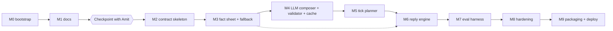

# 04 — Implementation Plan

Risk-ordered: contract correctness first (a malformed or slow bot scores nothing), then grounding (fabrication
caps every dimension at 5), then quality, then hardening. Each milestone lands on its own branch and PR
(ADR-011). Boxes are ticked in the same commit that lands the work.

## M0 — Ingestion and bootstrap
- [x] Clone/init, remote `origin`, bootstrap commit on `main`, branch `docs/m1-foundation`
- [x] Extract package into `reference/challenge/`, move challenge page and dossier into `reference/`
- [x] Run generator (`PYTHONUTF8=1`) → verified 5 / 50 / 200 / 100 / 30
- [x] `pyproject.toml`, ruff, mypy, pytest, pre-commit config, `.env.example`, `.gitignore`, `.gitattributes`
- [x] `CLAUDE.md` v0, `CHANGELOG.md`, smoke test (`tests/test_smoke.py`)
- **Accept**: generator counts verified; `ruff check`, `mypy`, `pytest` green. ✅

## M1 — Documentation set
- [x] 00 digest, 01 PRD, 02 TRD, 03 schema, 04 plan, 05 API contract + `openapi.yaml`
- [x] 06 composer spec, 07 trigger playbook, 08 voice guide, 09 conversation policy
- [x] 10 evaluation and test plan, 11 deployment runbook, 12 risk register, ADR-001…011
- [x] PR `docs/m1-foundation → main` opened (#1, merged); review checkpoint with Amit
- **Accept**: every B1–B11 and N-finding has a register entry and a TRD resolution; no case-study text in docs.

## M2 — Contract-correct skeleton (`feat/m2-skeleton`)
Depends on M1 approval.
- [x] `config.py` (env → settings, `.env` via python-dotenv)
- [x] `api/schemas.py` + `app.py`: all six endpoints, 500 KB guard on raw bytes, 400/409 semantics, custom
      validation handler (no 422), route guards (no 5xx), healthz counts from memory, metadata from env
- [x] `store/state.py` + `store/sqlite.py`: versioned ContextStore, conversations, suppressions, flags,
      write-through, restore window, teardown wipe
- [x] Stub composer: schema-valid actions from a fixed per-family template (placeholder for M3)
- [x] `scripts/run_simulator.py` wrapper (env config, UTF-8 mode, first-text-block patch, teardown first)
- **Tests**: contract suite (every `api-call-examples.md` case), restore-window unit tests
- **Accept**: contract suite green; simulator `warmup` and `all` run clean against localhost. ✅ (planner guards,
  ranking and per-merchant cap landed here too; M5 adds the property tests)

## M3 — Fact sheet and deterministic fallback (`feat/m3-facts-fallback`)
- [x] `compose/numbers.py` normalisation; `compose/facts.py` FactSheetBuilder with derived facts and the
      allowed-token index; `domain/salutation.py`, `domain/language.py`
- [x] `compose/playbook.py` + `merchant_kinds.py` + `customer_kinds.py`: registry for all 26 kinds + generic (07), consent gate + approval re-route,
      S-PERF / S-DIGEST / S-MISMATCH / S-SEASON rules
- [x] `compose/validator.py` V1–V17
- [x] Fallback wording per kind (English + Hinglish) inside the handlers, original wording
- [x] Golden set: 30 pairs + 8 uncovered kinds (38 cases), LLM disabled, snapshot-reviewed
- **Accept**: all 38 golden cases produce valid, grounded messages with the LLM off; grounding audit: zero
  untraceable tokens; similarity check clean. ✅ (sweep over all 100 triggers: 96 composed, 4 correct
  opt-out skips)

## M4 — LLM composer, repair loop, cache, precompute (`feat/m4-llm-composer`)
- [x] `llm/gateway.py` (AsyncAnthropic, `max_retries=0`, semaphore, error mapping, token logging)
- [x] `compose/prompts.py` (`composer_v1`), `compose/composer.py` (structured output, thinking disabled)
- [x] Drop-sentence → repair → fallback ladder; rationale always built in code
- [x] Canonical content hashing, persistent cache, single-flight precompute tasks, re-schedule on dependent
      version bumps (inside `compose/composer.py`; no separate module needed)
- [ ] Measure effort `low` vs default with a real key: latency p50/p99 and golden-set judge scores (pending API key)
- **Accept**: p99 tick < 8 s for 20 triggers cold, < 500 ms warm; zero validator escapes on the golden set.
  ✅ with a fake LLM (tests/perf); real-model latency to be measured once a key is available.

## M5 — Tick planner (`feat/m5-planner`)
- [x] `planner/tick.py`: resolve (listed only), guards with logged reasons, ranking, per-merchant cap, ≤ 20,
      deadline handling, commit (landed in M2)
- [x] **Tests**: hypothesis properties P1–P8 (10 §4)
- **Accept**: properties hold over generated tick sequences (40 examples × up to 6 ticks per property per run);
  simulator `full_evaluation` completes with no timeouts (needs a judge key). ✅ properties; found and fixed an
  empty-middle template bug.

## M6 — Reply engine (`feat/m6-replies`)
- [x] `reply/classifier.py` rules (English, Hinglish, Devanagari), per-merchant auto-reply counter
- [x] `reply/engine.py` state machine (09), lazy conversations seeded from history, replay idempotency
- [x] `reply/responses.py` deterministic replies + deliverables, `reply_v1` optional LLM phrasing, V17
- **Tests**: replay suite R1–R14
- **Accept**: replay suite 100%; simulator `auto_reply_hell`, `intent_transition`, `hostile` pass. ✅ (R1–R14
  + regression; official simulator `all`: every scenario PASS, auto-reply ends on the 3rd canned message)

## M7 — Evaluation harness (`feat/m7-eval`)
- [x] `eval/harness.py`: expanded dataset, incremental trigger pushes, persona-played reply turns, full-context
      LLM judge, grounding auditor (`eval/grounding.py`), similarity checker, repetition checker, latency capture;
      adaptation tests in `tests/replay/test_adaptation.py`
- [x] Results under `eval/results/<timestamp>/`; score row appended to `10` §13
- **Accept**: harness average ≥ 45/50; simulator `full_evaluation` average ≥ 45/50; no similarity above 0.6.
  Offline parts ✅ (0 findings, similarity 0.381); judge scores pending an API key.

## M8 — Hardening (`feat/m8-hardening`)
- [x] `scripts/soak.py` 10 req/s (2-minute run clean; 45-minute run before deploy); chaos cases (malformed
      merchants/customers/payloads for every kind, weird replies, context edge cases, 50 concurrent pushes)
- [x] Restart-recovery test (`-m slow`: kill mid-run, restart, compare state; outside the window → wiped)
- **Accept**: zero 5xx, zero timeouts, state intact after restart, teardown zeroes counts. ✅ (chaos found one
  root cause, wrong-typed nested fields, fixed at the `Ctx` boundary; 0 caught exceptions afterwards)

## M9 — Packaging and deployment (`feat/m9-release`)
- [x] `Dockerfile` (single worker, non-root, HEALTHCHECK), `.dockerignore`, `fly.toml` (Fly.io assumed)
- [x] `bot.py` (`compose(category, merchant, trigger, customer)`), `conversation_handlers.py`
      (`respond(state, message)`), `scripts/generate_submission.py` → `submission.jsonl` (30 lines; regenerate
      once an API key is set so it uses the LLM composer)
- [x] 1-page `README.md`; final docs pass; `CHANGELOG.md` release entry
- [ ] Optional: precomputed cache for the 100 base triggers
- [x] `scripts/smoke_public_url.sh` (passes locally)
- [ ] Deploy to the host, then smoke + simulator + harness against the public URL (needs Amit: host account,
      `fly auth login`, `ANTHROPIC_API_KEY`, contact email)
- **Accept**: pre-flight checklist in `11-deployment-runbook.md` §10 fully green.

## Cross-cutting gates (every PR)
- `ruff check`, `mypy`, default `pytest` green; docs updated in the same PR when behaviour changes;
  no secrets (pre-commit `detect-private-key`); no case-study text (similarity check once it exists).
