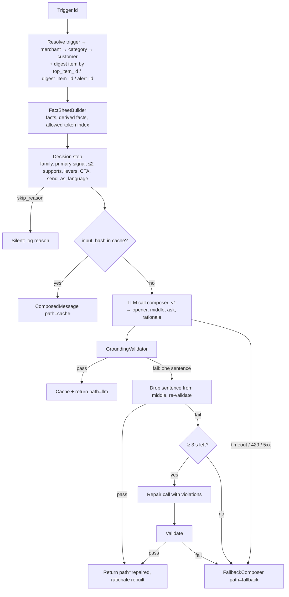

# 06 — Composer Specification

How a trigger becomes a message. Implements FR-1…FR-10 and FR-25. Architecture context: `02-TRD.md` §4.5–4.10.
Per-kind rules: `07-trigger-playbook.md`. Voice rules: `08-category-voice-guide.md`.

## 1. Pipeline


## 2. Fact sheet
### 2.1 What goes in
| Source | Facts (when present) |
|---|---|
| Trigger | kind, urgency, every payload scalar and list (metric, delta_pct, window, vs_baseline, deadline_iso, festival + date, match + venue + time, theme + occurrences + common_quote, molecule + batches + manufacturer, slots, days_remaining, renewal_amount, …) |
| Digest item (resolved by id) | title, source, summary, actionable, date, trial_n, patient_segment, credits |
| Merchant | name, owner first name, locality, city, verified, subscription status/plan/days, views, calls, directions, CTR, leads, 7-day deltas, active offers, expired offers, customer-aggregate numbers, signals (as plain-language labels), review themes with counts and quotes, last conversation turns |
| Category | peer stats, catalog offers (suggestion-only), seasonal beats, trend signals, patient-content titles, regulators and journals (as allowed source names), voice |
| Customer | first name (display form), language preference, state, last visit, visits, services, preferences (slots, stylist, focus), consent scope |
| Derived (code) | CTR %, gap to peer in points, ratio to peer, signed 7-day percentages, cohort shares, weeks between two payload dates, peer-relative position ("above/below the metro average") |

Signals are translated to plain language before the LLM sees them (`ctr_below_peer_median` → "CTR is below
the peer median"); raw snake_case never enters the prompt, which removes the main source of jargon leakage.

### 2.2 Relevance and visibility
Each fact gets `relevance` for the trigger's family (playbook table) and `visible_to_judge` (true for fields
the simulator's scorer prints: merchant name, owner, locality, languages, views/calls/ctr, signals, active
offers, trigger payload, customer identity). When two candidate primary signals are equally relevant, the
visible one wins. A non-visible fact used in the body must carry an in-text attribution ("this week's JIDA
digest", "your magicpin dashboard", "metro salon average").

### 2.3 Rendered format (what the LLM reads)
```
FACTS (quote numbers exactly as rendered; use no number that is not here)
F01 [trigger] Research item: "3-month fluoride varnish recall outperforms 6-month for high-risk adult caries"
F02 [trigger] Source: JIDA Oct 2026, p.14
F03 [trigger] Trial size: 2,100 patients
F04 [trigger] Result: 38% lower caries recurrence (3-month vs 6-month recall)
F05 [merchant] High-risk adult patients on roster: 124
F06 [merchant] CTR last 30 days: 2.1%   (peer average 3.0%, derived gap 0.9 points)
F07 [merchant] Active offer: Dental Cleaning @ ₹299
...
DECISION
primary: F04   supporting: F05, F02   levers: specificity, reciprocity, effort externalisation
cta: open_ended (offer to prepare something; one question)   send_as: vera
salutation: "Dr. Meera"   language: hinglish (Roman script)   first message in conversation: yes
```

## 3. Prompt architecture
Prompts live in `src/vera/compose/prompts/` as plain text with a version header. Changing any character bumps
the version (`composer_v1` → `composer_v2`), which changes every input hash and invalidates the cache.

### 3.1 `composer_v1` system prompt (structure)
1. **Role**: "You write one WhatsApp message for Vera, magicpin's assistant for local merchants, or for a merchant
   writing to their own customer. You write the words; the decision has been made."
2. **Hard rules** (numbered, short): use only facts listed; quote numbers exactly; no URLs; no taboo phrases
   (listed per category); no internal labels; no greeting preamble, no "I hope you are well", no
   self-introduction unless `first message: yes` and send_as is `vera`… and even then no more than 4 words;
   one question at most and only in `ask`; `ask` is exactly one sentence and is the only call to action; no
   relative dates unless the fact says them; catalog offers are suggestions ("want me to set up…"), active offers
   are theirs; never promise an attachment, PDF or link — deliverables are text you can write in the next reply.
3. **Voice block**: category tone, register, allowed vocabulary sample, salutation rule, emoji rule (08).
4. **Language block**: `hinglish` → natural Hindi-English in Roman script, English for technical terms and
   numbers; `english_light_hindi` → English with at most one short Hindi phrase; `english` → English only.
5. **Family block** (one of seven, from 07): what a strong message in this family does, e.g. knowledge →
   "lead with the finding and its source, connect it to one fact about this merchant, offer to turn it into
   something usable"; performance → "state the number and the window, give the likely driver only if a fact
   names it, one concrete fix"; customer → "name, why now, the real slot/price, no pressure".
6. **Output contract**: the JSON schema below (three prose fields).

User content = the rendered fact sheet (§2.3) + prior bodies sent to this merchant ("do not reuse their
phrasing") + for repairs, the violation list.

### 3.2 Few-shot policy
- No case-study text anywhere in prompts, fixtures or templates (the judge runs a similarity check).
- Default is zero-shot with rules. If M4 evaluation shows a family needs an example, add **one original**
  example per family, written for a different merchant/kind than any case study, and check it with the
  similarity checker (ratio ≤ 0.6) before committing.

### 3.3 Request settings
| Setting | Value | Why |
|---|---|---|
| model | `VERA_COMPOSER_MODEL` (`claude-sonnet-5`) | quality in Hinglish and clinical registers |
| thinking | `{"type": "disabled"}` | Sonnet 5 runs adaptive thinking when omitted; latency |
| sampling | none | `temperature`/`top_p` are rejected (400) on Sonnet 5; determinism via cache |
| output | `output_config={"format": {"type": "json_schema", "schema": COMPOSER_SCHEMA}}` | parseable by construction |
| max_tokens | 600 | message ≈ 80–150 tokens; headroom for Hinglish |
| timeout | deadline remaining, queue wait included; the HTTP call itself is capped at `VERA_LLM_TIMEOUT_S` once a concurrency slot is free | never outlive the tick; a queue must not eat a fixed per-call cap (bulk precompute died at 6 s despite its 25 s budget) |
| retries | 0 | the deadline, not the SDK, decides |

Effort (`output_config.effort`) is measured in M4 (`low` vs default) and fixed in the prompt-version notes.

## 4. Output schema
```json
{
  "type": "object",
  "additionalProperties": false,
  "required": ["opener", "middle", "ask"],
  "properties": {
    "opener":    { "type": "string", "description": "Salutation only, e.g. 'Dr. Meera,' or 'Hi Priya 👋'" },
    "middle":    { "type": "string", "description": "1-3 sentences: why now + the primary fact + support. No question." },
    "ask":       { "type": "string", "description": "Exactly one sentence, the only call to action." }
  }
}
```
The rationale is built in code from the decision (trigger, primary signal, levers, CTA, language), so it always
matches the body and costs no output tokens. Code then sets: `body = opener + " " + middle + " " + ask` (whitespace-normalised), `template_params =
[opener, middle, ask]`, `template_name` and `cta` from the decision, `send_as`, `suppression_key`. The template
for every `template_name` is `{{1}} {{2}} {{3}}`, so params always render to the body.

## 5. Validator rules
Applied to tick and reply output alike. Normalisation first: Unicode NFKC, `Rs`/`INR`/`Rs.` → `₹`, strip
thousands separators (`2,410` / `2,100` / Indian `1,20,000`), `lakh` → ×100000, `k` → ×1000, unicode minus →
`-`.

| # | Rule | Check | Allowed-list sources |
|---|---|---|---|
| V1 | Structure | opener, middle, ask all non-empty (WhatsApp template params cannot be empty); body ≤ 900 chars; `?` appears only in `ask` | — |
| V2 | Single CTA | `ask` is one sentence; `middle` contains no imperative CTA markers ("reply", "click", "call us", "tap") | — |
| V3 | No URLs | regex for `http`, `www.`, bare domains (`\w+\.(com|in|ai|io|org)\b`) | — |
| V4 | Taboos | case-insensitive phrase match on `voice.vocab_taboo` + `voice.taboos`, parentheticals stripped (`"best price (without supporting data)"` → `"best price"`) | — |
| V5 | Jargon | snake_case tokens; field names (`payload`, `trigger`, `ctr_below_peer_median`, …); `placeholder` | — |
| V6 | Numbers | every digit-run (after normalisation) must be in `allowed_numbers` or be an integer ≤ 10 | all fact renderings, derived facts, slot labels, and — in replies — digits in the merchant's inbound |
| V7 | Dates | day+month or ISO dates must match a payload/slot/digest date | trigger payload, digest `date`, slots, customer relationship dates |
| V8 | Relative time | "in N days/weeks", "N days left/to go" only if N is a payload value (e.g. `days_remaining`) | payload |
| V9 | Acronyms | ALL-CAPS tokens (≥ 2 letters) in allowlist or context | allowlist: `GBP, CTR, ORS, OTC, MRP, RCT, OPG, IOPA, RVG, DCI, IDA, CDE, PT, HIIT, BOGO, IPL, GST, FSSAI, CDSCO, AOV, SPF, OK, YES, NO, STOP, CONFIRM` + context strings |
| V10 | People | honorific + capitalised name (`Dr. X`, `Mr. X`, `Ms. X`, `X ji`) must match owner, customer (or parent), a stylist/instructor named in context, or a digest speaker | `allowed_names` |
| V11 | Sources | phrases like "study/trial/circular/survey/report/journal/as per X" must name a source present in context | `allowed_sources` |
| V12 | Re-introduction | after turn 1 of a conversation: no "this is Vera", "Vera here", "I am Vera" | — |
| V13 | Repetition | normalised body hash not in the merchant's `sent_body_hashes`; also no sentence identical to a prior body's sentence | merchant flags |
| V14 | Plagiarism | `difflib.SequenceMatcher` ratio vs every case-study body ≤ 0.6 | `reference/challenge/examples/case-studies.md` |
| V15 | Language | `hinglish` directive: at least two Hindi function words in Roman script (`hai, hain, ke, ki, kar, aap, aapke, mein, toh, bhi, nahi, kya`); `english`: none of the unambiguous ones (`hai, hain, aap, aapke, nahi, kya`); any language: no Devanagari characters (all output is Roman script) | — |
| V16 | Salutation | opener contains the decided salutation name; no "Dr. Dr." | decision |

Violations are reported as codes (`V6:31`, `V11:Lancet`) in logs and in the repair prompt.

## 6. Fallback templates
- Each kind handler (`merchant_kinds.py`, `customer_kinds.py`) writes the fallback as `lines` + `ask` in
  English and Hinglish (`ctx.t(en, hi)` for merchants, `ctx.tc(en, hi)` for customers), interpolating only
  values it read from the contexts or registered with `ctx.derive()`.
- The same wording is handed to the LLM as the reference draft, so LLM output starts from grounded text.
- `composer.fallback_message` validates the fallback; offending sentences are dropped, and a message with no
  middle left is skipped (restraint beats a weak or ungrounded send).
- Wording is original and reviewed against the similarity checker in CI.
- Fallbacks are deliberately plainer than LLM output; they exist so a timeout never costs a message.

## 7. Prompt versioning and audit
- `prompt_version` is part of the input hash and of every audit record.
- A prompt change requires: golden-set rerun (`tests/golden`), grounding audit clean, similarity check clean,
  and a line in `CHANGELOG.md` with the eval delta.

## 8. Worked decision (illustration only, not a template)
Trigger `trg_004_perf_dip_bharat` (calls −50% over 7d vs baseline 12) for Bharat Dental Care, Andheri West,
unverified GBP, renewal in 12 days, no active offers:
- Primary: calls −50% vs baseline 12 (payload, judge-visible). Supporting: GBP unverified (signal, visible);
  catalog "Free Consultation" as a suggestion.
- Levers: loss aversion, effort externalisation. CTA: `binary_yes_no`. Language: `hinglish` (languages
  en/hi/mr; `mr` is not in the southern set, so the Hindi-belt rule applies).
- Deliberately *not* used: the renewal (a different trigger owns it) and the 95 lapsed patients (second
  signal would dilute the message).
